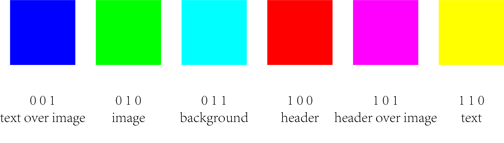
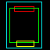
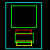

# Scene Graph to Layout

Reimplement part of [sg2im](https://github.com/google/sg2im) in TensorFlow 2.3, 
and trained it on [magazine dataset](https://xtqiao.com/projects/content_aware_layout/) to generate layout data from scene graph.  

## Introduction  

Scene graph is kind of data structure describing the relationships of different objects. And using scene graph to generate images has made a big breakthrough, e.g. [Image Generation from Scene Graphs](https://arxiv.org/abs/1804.01622).  

We notice that *layout* is a useful by-product of [sg2im](https://github.com/google/sg2im), which is important in the field of graphic design. So, it can be a good idea to use `sg2im` to generate layout of different design elements, which has been taken as baseline of [Neural Design Network](https://arxiv.org/abs/1912.09421).  

In this repo we implement this idea using TensorFlow 2.3.  

Here we list some generated layouts using this model.  

  

| Scene Graph | Layout |  
| --- | --- |  
| **objects:**<br/>["header", "image", "text", "background"]<br /><br />**relationships:**<br />[0, "above", 1]<br />[1, "above", 2]<br /> [0, "inside", 3]<br />[1, "inside", 3]<br />[2, "inside", 3] |  |  
| **objects:**<br />["header", "image", "text", "image", "background"]<br /><br />**relationships:**<br />[0, "above", 1]<br />[1, "above", 2]<br />[3, "above", 0]<br />[0, "inside", 4]<br />[1, "inside", 4]<br />[2, "inside", 4]<br />[3, "inside", 4] |  |  

## Setup  

Download dataset (for training) or pre-trained model (for testing) from [here](https://drive.google.com/drive/folders/15-I89_qsvPqXj8G35nBwTADgt9BhSuef?usp=sharing).  

Move `ckpt-100.*` to `./ckpt` and `magazine.zip` to `./data`.  

Unzip `magazine.zip` if you need to train.  

```shell
unzip magazine.zip
```

And the directory tree should be like this:  

```shell
.
├── LICENSE
├── README.md
├── ckpt
│   ├── ckpt-100.data-00000-of-00001
│   └── ckpt-100.index
├── data
│   ├── magazine
│   └── magazine.zip
├── dataset.py
├── main.py
├── models
│   ├── __init__.py
│   ├── __pycache__
│   ├── graph.py
│   ├── layers.py
│   └── sg2im.py
├── requirements.txt
...
```

Prepare environment  

```shell
python3 -m venv venv
source venv/bin/activate
pip install -r requirements.txt
```

Train  

> You need to specify data, checkpoint and output directory.  

```shell
python main.py --mode train --data_dir ./data/magazine --checkpoint_dir %WHERE_YOU_WANT_TO_SAVE_CKPT --output_dir %WHERE_YOU_WANT_TO_SAVE_SAMPLES
```

Test  

> You need to specify checkpoint path and output directory.  

```shell
python main.py --mode test --checkpoint_path ./ckpt/ckpt-100 --output_dir %WHERE_YOU_WANT_TO_SAVE_TEST
```

## Feature Work  

- Add more kinds of constrains, like size, between layout elements.  
- Add more features, like image feature extracted from ResNet.  
- Add VAE or GAN to generate diverse layouts for same input graph.
